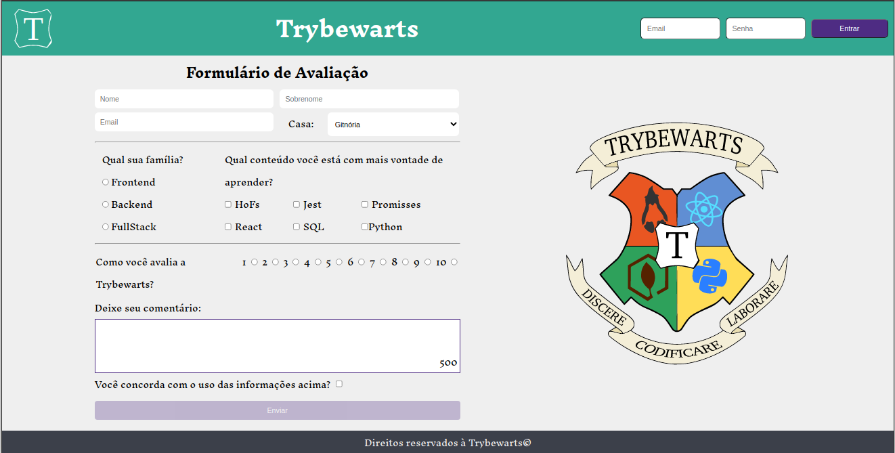

<h1 align="center">Trybewarts</h1>


## Índice

- [Descrição](#page_facing_up-descrição)
- [Habilidades desenvolvidas](#bulb-habilidades-desenvolvidas)
- [Funcionalidades](#sparkles-funcionalidades)
- [Ferramentas](#hammer_and_wrench-ferramentas)
- [Como usar online](#signal_strength-como-usar-online)
- [Como usar no ambiente local](#computer-como-usar-no-ambiente-local)
- [Autor](#memo-autor)


## :page_facing_up: Descrição

Esse foi o meu primeiro projeto em dupla na Trybe. Usando HTML, CSS Flexbox e Javascript DOM, O desafio proposto no projeto foi desenvolver uma página de formulário da Escola de Magia de Trybewarts, em que as pessoas estudantes poderão enviar seus feedbacks sobre ela. O tema desse projeto é baseado na obra 'Harry Potter', de J. K. Rowling.


## :bulb: Habilidades desenvolvidas
<details>
  <summary><strong>Ver mais</strong></summary>

- Criar formulários em HTML.

- Utilizar CSS Flexbox para criar layouts flexíveis.

- Criar regras CSS específicas para serem aplicadas a dispositivos móveis.

- Construir páginas que alteram o seu layout de acordo com a orientação da tela.
</details>


## :sparkles: Funcionalidades
<details>
  <summary><strong>Ver mais</strong></summary>

:heavy_check_mark: Formulário de avaliação da escola

:heavy_check_mark: Listar a avaliação depois de enviada
</details>


## :hammer_and_wrench: Ferramentas
<details>
  <summary><strong>Ver mais</strong></summary>

* [HTML 5](https://www.w3schools.com/html/)
* [CSS 3](https://www.w3schools.com/css/)
* [JavaScript ES6+](https://www.w3schools.com/js/js_es6.asp)
* [JavaScript DOM](https://www.w3schools.com/js/js_htmldom.asp)
* [Github Pages](https://pages.github.com/)
</details>


## :signal_strength: Como usar online
<details>
  <summary><strong>Deploy</strong></summary>

O deploy desse projeto foi feito na plataforma Github Pages. Para usar a aplicação, basta clicar no link abaixo:

https://leo02452.github.io/trybewarts
</details>


## :computer: Como usar no ambiente local
<details>
  <summary><strong>Pré-requisitos</strong></summary>

Antes de começar, você vai precisar ter instalado em sua máquina as seguintes ferramentas:

- [Git](https://git-scm.com)
</details>

<details>
  <summary><strong>Rodando a aplicação</strong></summary>

1 - Clone esse repositório para sua máquina com o seguinte comando:

```bash
 git clone git@github.com:Leo02452/trybewarts.git
```

2 - Via interface gráfica, vá até a pasta 'trybewarts' criada. Entre nela.

3 - Dê um duplo clique no arquivo index.html
</details>


## :memo: Autor

Desenvolvido por Leonardo Araujo

Email: leonardo_02452@hotmail.com

Github: https://github.com/Leo02452

LinkedIn: https://www.linkedin.com/in/leo02452/

---

# Sobre o projeto

Esse foi o meu primeiro projeto em dupla pela Trybe e o primeiro criando um formulário em HTML e utilizando CSS Flexbox.

A proposta do projeto era desenvolver página de formulário da Escola de Magia de Trybewarts, em que as pessoas estudantes poderão enviar seus feedbacks sobre ela. Ao clicar em submit, você verá um resumo de todas as informações que você forneceu ao formulário.

Esse foi o modelo de exemplo:


E essa foi a página que fizemos:


---

## Link para o deploy:

https://Leo02452.github.io/trybewarts
